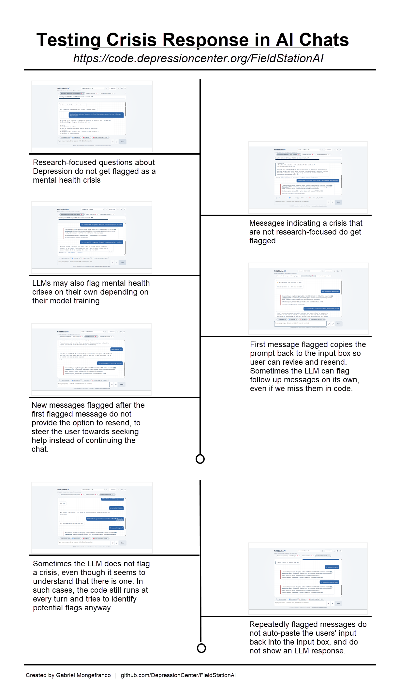

<!--
This file is part of Field Station AI.
security-privacy-accessibility.md: Security and accessibility guide for developers working on Field Station AI, in Markdown format.
Author(s): Gabriel Mongefranco.
Created: 2026-07-26
Last Modified: 2026-09-29
Summary: Field Station AI is a private, in-browser AI workspace for health and behavioral researchers.
Notes: See README file for documentation and full license information.

Copyright © 2026 The Regents of the University of Michigan

Licensed under the GNU Free Documentation License v1.3 or later.
See <https://www.gnu.org/licenses/fdl-1.3.html>. See README for full license information.

-->

# Field Station AI™: Security, Privacy, PHI, and Accessibility

## Privacy Model

Field Station AI™ is designed so research data is processed in the browser by default. The provided app code should not be described as sending chat text or attached file contents to a cloud AI API by default.

Network activity can still occur for:

- Downloading JavaScript libraries and fonts.
- Downloading model files.
- Fetching the bundled compendium file or an external one.
- Loading or using local Ollama if configured.
- Browser speech recognition, which may be browser/vendor serviced depending on browser.
- Browser spell checking. Some browsers send the text of a spell-checked box to an online service when the person has turned on an enhanced spell checker. The Field Kit **Paste text** box turns spell checking off. The chat prompt box and the other text boxes leave it to the browser's setting.
- Opening external links.

## PHI Posture

Assume uploaded files and prompts may contain PHI or other sensitive research data.

Do not write UI copy, documentation, tests, screenshots, logs, or examples that imply:

- “PHI cleared.”
- “HIPAA compliant.”
- “De-identified.”

Use those claims only after formal review and approval outside this codebase.

## Research Data Rules

Required practices:

- Preserve source files.
- Transform copies, not originals.
- Do not put identifiers in filenames, logs, URLs, screenshots, or issue reports.
- Use synthetic examples in documentation and tests.
- Validate joins and merges to avoid accidental row multiplication.
- Route decisions involving PHI, IRB, institutional policy, or Information Assurance to the appropriate review process.

## Secrets

Do not commit:

- API keys.
- Access tokens.
- Connection strings.
- Participant data.
- Generated research outputs.
- Local cache folders.
- Model or embedding cache artifacts.
- Generated compendiums containing sensitive content.

Use environment variables, local config files excluded by `.gitignore`, or institution-approved secret storage for sensitive values.

## PIN and Browser Storage Risks

PIN protection, where available, is a local deterrent. It is not equivalent to device encryption, institutional endpoint controls, or formal access management.

Browser storage is local to the browser profile and origin. It can be cleared or evicted by the browser, enterprise policy, user action, or storage pressure.

Recommended researcher practice:

- Use a non-shared browser profile.
- Set a PIN before attaching sensitive files when supported.
- Download important outputs promptly.
- Keep source data outside the app.
- Avoid identifiers in filenames.

## Storage Dialog

The Storage dialog lists the chats, attachments, models, and compendiums saved in the browser, and deletes them one at a time. It reads and deletes local data only. It sends nothing to a network.

- Names of chats and files come from the person and are untrusted. Every row is built with `createElement` and `textContent`, so markup in a name is shown as text. The same names appear in the confirmation box, which the browser shows as plain text.
- The dialog shows file names and chat names on screen. Do not take screenshots of it when the names may identify a participant.
- With a PIN set and not entered, the app has not read the chats. The dialog then lists no chats and no attachments, and shows no file name.
- Sizes are read from the stored records as they are. No attachment is decrypted to build the list.
- An external compendium is listed by its site name, host, and path. The query part of its address is left out, because a link to a private file may carry an access token there.
- Every delete asks for confirmation first. A delete is refused while a reply is being written, and a model delete is refused while a model is loading.
- Each delete goes through the path the rest of the app uses, so the related records go with the item. See [Data, Files, Attachments, and Compendiums](data-files-and-compendiums.md#the-storage-dialog).
- Deleting removes the data from the browser's storage. It does not overwrite the space on disk. Treat a shared or lost computer as a risk that deleting in the app does not remove.

## Destination-Aware Redaction

Redaction should depend on where text goes.

Design rule:

- In-browser model paths may use real local sampled values when needed for accuracy.
- Network-addressable or separate-process model paths require redaction before sending cell values where the feature promises redaction.
- Exported reproducibility artifacts should not carry PHI.

This is defense-in-depth, not formal de-identification.

## Crisis Detection Method

Field Station AI™ screens each chat prompt for language consistent with an acute mental health crisis in the person typing, and responds with a fixed referral to the 988 Suicide and Crisis Lifeline in place of a generated reply. The method is described here so that researchers and developers of similar tools can judge its scope, its failure modes, and its fit for a given study population.

### Rationale

The application is not a clinical tool and does not deliver care. It is, however, distributed by a depression center and may be encountered by participants in distress. The design goal is a conservative, transparent screen: it should recognize explicit first-person statements of suicidal intent or a wish to die, avoid engaging clinically, and avoid interfering with legitimate research use, in which suicide and self-harm are frequent subjects of discussion.

### Detection

Three tiers are applied in order, each invoked only when the previous one is not decisive. All three run locally in the browser before any language model receives the prompt, on every model the application offers, whether or not the intent router is active.

1. Lexical screen. A curated set of first-person, present-tense expressions in English and Spanish (for example, wanting to die, a plan to end one's life, being suicidal). A co-occurring research or clinical context term (participant, transcript, survey, screening, and similar) suppresses this tier, so that quoted or reported speech is not treated as the writer's own statement. This tier is applied only to short prompts; longer text, such as a pasted transcript, proceeds to the semantic screen.
2. Semantic screen. This tier reads a prompt only when it contains at least one word from a broad list of subject words (for example die, life, hurt, pills, myself, and their Spanish counterparts). A prompt with none of them is answered normally, and no model runs for it. The prompt is then embedded with the same sentence-embedding model used for retrieval and compared, by cosine similarity, with three curated sets: crisis exemplars (first-person statements), contrast exemplars (research, clinical, and data tasks on the same subject matter), and everyday exemplars (ordinary prompts, many built like a crisis statement or using a subject word in its everyday sense, such as "my phone is dying"). A prompt is flagged only when its similarity to the crisis set exceeds an absolute floor and exceeds its similarity to each of the other two sets by a margin. Topical overlap alone does not trigger the referral, and neither does the shape of a sentence.
3. Entailment tiebreak. When the margin falls within a narrow band, a small natural-language-inference model tests the prompt against two hypotheses: that the writer is describing their own current crisis, and that the prompt concerns mental health as a subject. The referral is shown only when the first hypothesis is preferred.

The embedding and inference models are English-language models. Spanish coverage rests on the lexical tier.

### Response

The referral text is fixed. It is never generated, paraphrased, or extended by a language model, so its wording does not vary with the model in use. It contains the 988 number, the 988 Lifeline chat address, and the Spanish access options. Consistent with the policy of the Depression Center Resources agent in Microsoft Copilot, the application does not assess risk, ask safety questions, or offer clinical guidance. The referral is stored within the chat, re-appears on reload and in the text export, and is never passed to the language model as conversation history.

### Escalation

A single referral may be a false positive, and research users must be able to proceed. The first referral in a chat therefore invites the person to send the message again, and the message remains in the input field. That re-send is answered by the model. Screening continues silently on every subsequent prompt. A second flagged prompt after the first referral is treated as a strong signal of genuine crisis: the referral is shown again, without the invitation to continue, and every further flagged prompt in that chat receives the referral rather than a generated reply. Prompts that are not flagged continue to be answered, and the chat is never locked, so a person in distress is not cut off and a researcher retains their context. A new chat starts the sequence over.

### Observed behavior

The screenshot series below was recorded during manual testing with Llama 3.2-1B and the bundled compendium. Every chat in it is synthetic.

The panels show, in order:

1. Research-focused questions about depression are answered normally and are not flagged as a crisis.
2. A message that indicates a crisis and is not research-focused is flagged, and the referral replaces the reply.
3. Language models may also flag a crisis on their own, depending on their training. Here Llama 3.2-1B declined to engage with a re-sent message.
4. The first flagged message is copied back into the input box so the person can revise and resend. A model can sometimes flag a follow-up message on its own even when the screen misses it.
5. Messages flagged after the first one do not offer the option to resend, to steer the person toward help rather than continuing the chat.
6. Sometimes the model does not flag a crisis even though its reply suggests it understood one. The screen still runs on every turn for that reason.
7. Repeatedly flagged messages do not paste the input back into the box and do not show a model reply.

### Validation

The method is checked against a fixed, synthetic prompt set (`tests/fixtures/crisis-prompts.json`) in two ways: a dependency-free test of the lexical tier, and a test that runs the embedding and inference models over every prompt. Both run in continuous integration. The set holds first-person crisis statements in English and Spanish, research, clinical, and third-party prompts that must not be flagged, and everyday prompts that must not be flagged. The model test scores the set with both sets of embedding weights the application can load, because the two differ enough to cross a threshold. Threshold values were tuned against this set and are recorded in the code.

The set passing says little about new prompts, because the lists were tuned against it. On 2026-09-29, prompts written after the lists were set were scored once, in two batches. Of 63 first-person crisis statements, 56 were flagged. Of 179 everyday prompts, chosen to be hard (most use a subject word or copy the shape of a crisis statement), 171 were answered normally with the full-precision weights and 174 with the 4-bit weights. These counts describe synthetic prompts written by the developers. No clinical validation has been performed. Sensitivity and specificity against clinical criteria are unknown.

### Limitations

- The screen detects language, not risk. It cannot recognize a crisis expressed indirectly, in a language other than English or Spanish, or inside an attached file. Only chat prompts are screened.
- A crisis statement that uses none of the subject words is not flagged. Examples from testing: "I am thinking about walking into traffic" and a statement about a rope that never says what it is for.
- False positives occur for first-person quotations that lack a surrounding research cue, and for some ordinary sentences that use a subject word in a shape close to a crisis statement. An example from testing: "I am going to cut my hair short". The escalation rule bounds their cost to one re-send per chat.
- Behavior on the invited re-send depends on the language model. Larger instruction-tuned models generally decline to engage with self-harm content; the smallest models may not. The escalation rule exists because of this.
- No data leaves the browser during screening, and prompt text is not logged. Referral events are stored only within the chat, in the browser.

## Text Handed From Chat to Field Kit

With a "+ Router" model chosen, the app checks each chat prompt for a request that a Field Kit text tool can do, and offers that tool under the prompt. The check runs in the browser with the embedding model the router already uses. No data leaves the browser for it, and the prompt is not logged.

- An offer comes from the words of the prompt only. A file attached to the chat does not bring one.
- The offer shows fixed wording and the tool's name. It never shows text from the prompt.
- Pressing the button copies the prompt's text into the tool's **Paste text** box. The text is set as the value of the box, so markup in it is never read as markup. It goes through the same size limit as pasted text.
- The tool does not run until the person starts it. Opening a tool writes nothing to chat history or to browser storage, and results reach a chat only through Send to Chat.
- Offers are kept in memory and are gone after a reload. The prompt itself is a chat message and is stored with the chat, as every prompt is.
- The check is a best effort. It can miss a request or offer a tool for a prompt that did not ask for one.

## Logging and Exports

Console errors may include technical details. Avoid capturing logs or screenshots with real participant data.

Review downloaded files, transcripts, CSVs, summaries, notebooks, and generated indexes before sharing. Column names, filenames, and aggregate summaries can still reveal study context.

## Accessibility Target

Target WCAG 2.1 AA or WCAG 2.2 AA.

Minimum checks:

- All controls reachable by keyboard.
- No keyboard traps.
- Visible focus indicators.
- Labels or accessible names for controls.
- Dynamic status changes announced when needed.
- Color is not the only indicator of state.
- Text contrast meets AA expectations.
- Reduced-motion preference respected for animations.

No formal accessibility audit result is included in the provided documentation set.

## Manual Accessibility Verification

Before release, test:

1. Navigate all chat controls with keyboard only.
2. Open and close menu, compendium picker, PIN dialog, Advanced settings dialog, Storage dialog, and Field Kit by keyboard.
3. In Advanced settings, change each number with the minus and plus buttons and by typing, and confirm a screen reader announces the new value.
4. Confirm focus is visible and logical.
5. Confirm dialogs do not trap focus permanently.
6. Test screen-reader announcement of status and progress messages.
7. Confirm color is not the only state cue.
8. Test reduced-motion mode.
9. In the Storage dialog, delete an item with the keyboard only. Confirm that a screen reader reads the item's name and details with the **Delete** button, announces the result, and that focus stays inside the dialog.
10. Send a crisis test prompt from `tests/fixtures/crisis-prompts.json`, confirm a screen reader announces the notice, and reach its 988 chat link with Tab.
11. In a Field Kit text tool, move between the input tabs with the arrow keys, confirm a screen reader announces each tab as selected, and reach the **Paste text** box and **Clear text** with Tab.
12. Send an offer test prompt from `tests/fixtures/skill-offer-prompts.json`, confirm a screen reader announces the offer, reach its button with Tab, press Enter, and confirm focus lands in the tool's **Paste text** box.

Automated check:

- Run a browser accessibility scanner such as axe DevTools.
- Fix critical and serious findings before release.

[⬅ Back to Documentation](README.md) | [⬅ Back to project README](../README.md)

---

Documentation licensed under the GNU Free Documentation License, version 1.3 or later.

Copyright © 2026 The Regents of the University of Michigan